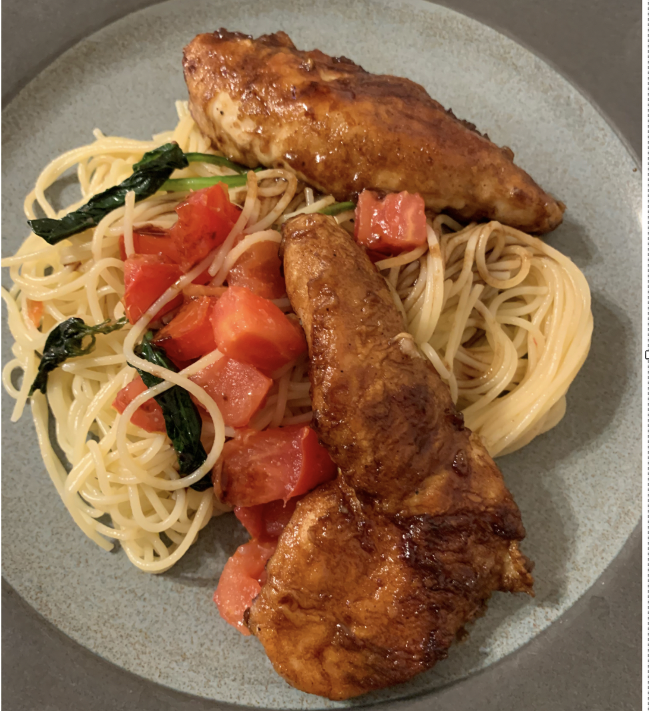
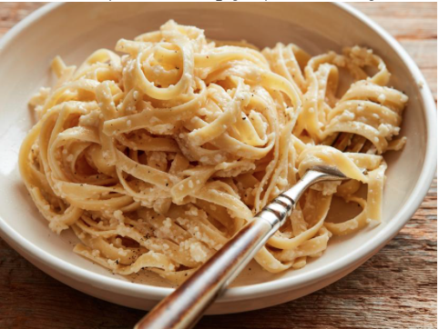
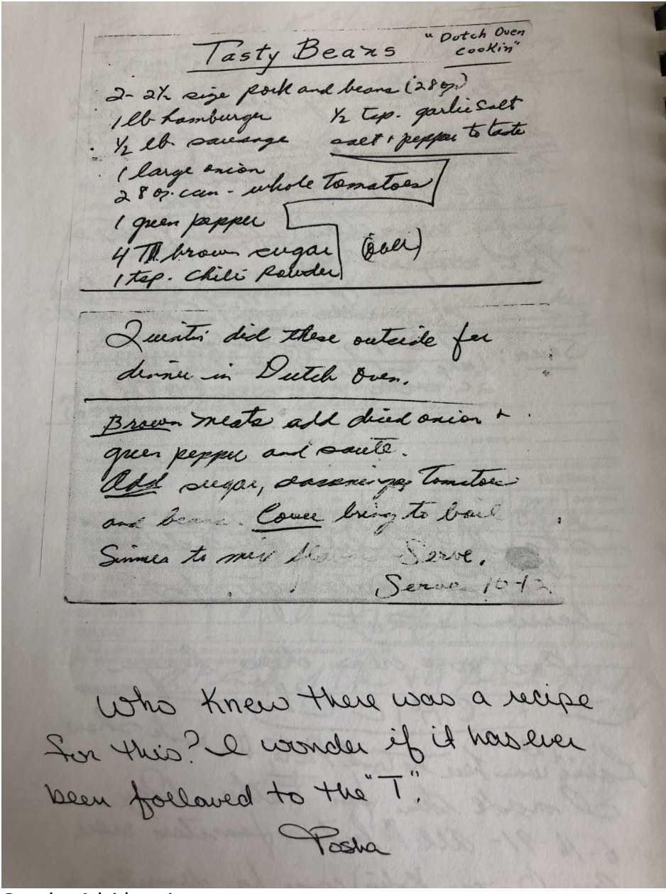
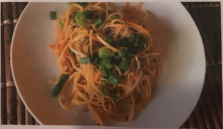
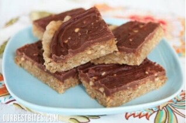
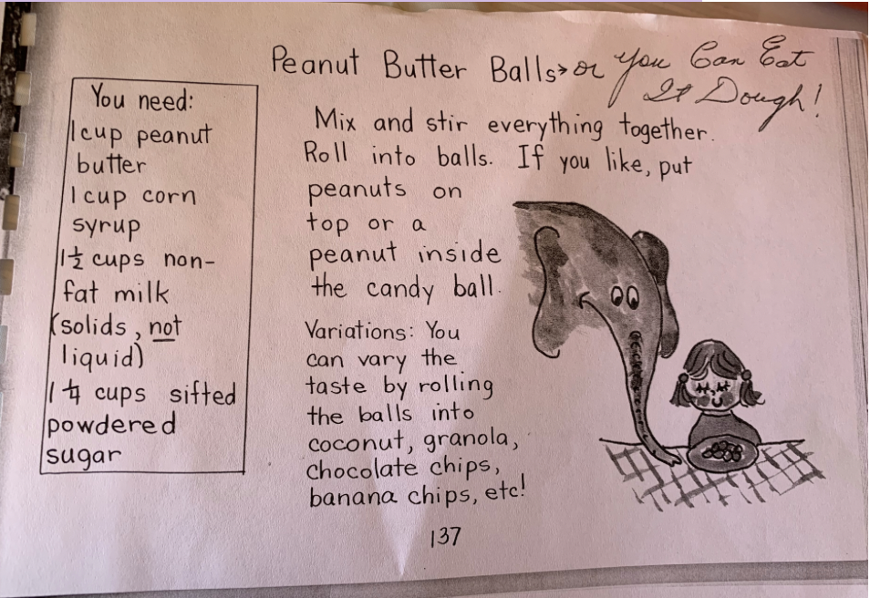
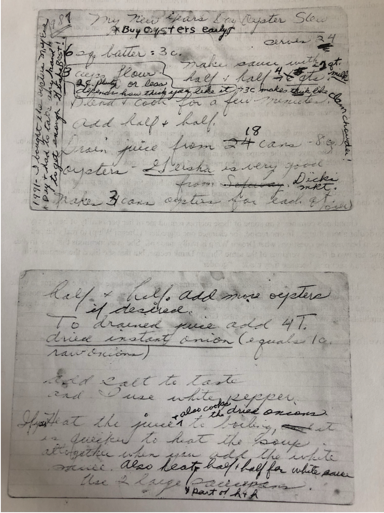

# Family Favorite Recipe Book

A collection of our favorite family recipes and stories.

## Table of Contents
- [How to Use This Book](#how-to-use-this-book)

| Category | Category |
| --- | --- |
| **Breakfast** [1) German Pancakes](#1-german-pancakes) [2) Pudding Toast](#2-pudding-toast) | **Mains** [3) Chicken Balsamico](#3-chicken-balsamico) [4) Fettuccine Alfredo](#4-fettuccine-alfredo) [5) Hamburger Rice](#5-hamburger-rice) [6) Mom's Roast](#6-moms-roast) [7) Mom's Potato Pea Soup](#7-moms-potato-pea-soup) [8) Tasty Beans (Grandpa Adair)](#8-tasty-beans-grandpa-adair) |
| **Sides** [9) Easy Brazilian Cheese Bread (Pão de Queijo)](#9-easy-brazilian-cheese-bread-p-o-de-queijo) [10) Classic Sourdough Bread](#10-classic-sourdough-bread) [11) Hayes' Bean Dip](#11-hayes-bean-dip) [12) Jessica's Spinach Salad](#12-jessicas-spinach-salad) [13) Thai Pasta Salad](#13-thai-pasta-salad) | **Desserts** [14) Chocolate-Frosted Peanut Butter Cookie Bars (Lunch Lady Peanut Butter Bars)](#14-chocolate-frosted-peanut-butter-cookie-bars-lunch-lady-peanut-butter-bars) [15) Chocolate Chip Oatmeal Cookies](#15-chocolate-chip-oatmeal-cookies) [16) Grandma Kartchner Molasses Cookies](#16-grandma-kartchner-molasses-cookies) [17) Heather's Chocolate Chip Bundt Cake](#17-heathers-chocolate-chip-bundt-cake) [18) Ina Garten Style Old-Fashioned Apple Crisp](#18-ina-garten-style-old-fashioned-apple-crisp) [19) Mom's Italian Cream Cake](#19-moms-italian-cream-cake) [20) Mochi Butter Cake](#20-mochi-butter-cake) [21) Peanut Butter Balls (You Can Eat It Dough)](#21-peanut-butter-balls-you-can-eat-it-dough) |
| **Holiday** [22) Lemon Cheese Braid Bread](#22-lemon-cheese-braid-bread) [23) Oyster Stew](#23-oyster-stew) |  |

## How to Use This Book
- Add/edit recipes in `recipes/`.
- Keep `RECIPE_INDEX.md` updated with links to each recipe.
- Watch the [How to Add a Recipe video](https://youtu.be/ikExgXvNtG8).
- Regenerate this file with `python3 scripts/generate_recipe_book.py`.

---

## 1) German Pancakes
**Recipe Owner:** Heather Adair  
**Serves/Yield:** 6 servings  
**Prep time:** 10 min  
**Cook time:** 25 min  
**Estimated macros (est.):** ~250 cal | 10g protein | 11g fat | 27g carbs (per serving, serves 6)

### Ingredients
- 1 cup flour
- 1 cup milk
- 6 eggs
- 1/2 tsp salt
- 1/2 cup butter
- Powdered sugar, for dusting

### Instructions
1. Heat oven to 450°F.
2. Melt butter in a 9 x 13-inch pan in the oven.
3. Blend milk, eggs, flour, and salt until smooth.
4. Pour batter into the hot pan and bake about 25 minutes, until puffed and golden.
5. Dust with powdered sugar. Cut and serve plain or with fruit or syrup.

### Family Notes
- Also known as Egg Puff.

---

## 2) Pudding Toast
**Recipe Owner:** Grandma Lewis  
**Serves/Yield:** 4 servings  
**Prep time:** 10 min  
**Cook time:** 5-8 min  
**Estimated macros (est.):** ~250 cal | 5g protein | 8g fat | 39g carbs (per serving)

### Ingredients
**Pudding Base**
- 1 tbsp cornstarch
- 1/8 cup sugar
- Pinch of salt
- 1 cup milk
- 1 egg yolk
- 1 tbsp butter
- 1 tsp vanilla

**For Serving**
- Toasted, buttered bread (torn into small pieces)

### Instructions
1. Mix cornstarch, sugar, and salt.
2. Stir in milk and egg yolk until smooth.
3. Microwave 1 minute at a time, stirring between each minute, until thick pudding forms.
4. Remove from microwave and stir in butter and vanilla.
5. While pudding cooks, toast and butter bread; tear into small pieces.
6. Pour warm pudding over toast pieces and serve.

### Family Notes
- Passed down from Grandma Lewis. A Danish dish with tweaks over the years.

---

## 3) Chicken Balsamico

**Recipe Owner:** Kristine  
**Serves/Yield:** 4 servings  
**Prep time:** 20 min  
**Cook time:** 25 min  
**Estimated macros (est.):** ~760 cal | 55g protein | 28g fat | 67g carbs (per serving)

### Ingredients
- 2 cups flour
- Salt and pepper, to taste
- 1/3 cup olive oil
- 4 (8 oz) chicken breasts, butterflied
- 1 cup balsamic vinegar
- 1/4 cup olive oil
- 2 tsp fresh chopped garlic
- 3 cups fresh baby leaf spinach
- 1 cup diced Roma tomatoes
- 10 oz angel hair pasta
- 2 tbsp shredded Parmesan cheese

### Instructions
1. Season flour with salt and pepper.
2. Cut each chicken breast in half to make medallions.
3. Heat 1/3 cup olive oil in a saute pan.
4. Dredge chicken in seasoned flour and saute until cooked through.
5. Add balsamic vinegar and reduce around chicken until liquid is mostly gone.
6. In another saute pan, heat 1/4 cup olive oil.
7. Add garlic, spinach, tomatoes, and salt/pepper; saute until spinach is cooked and garlic is heated (do not burn garlic).
8. Cook angel hair pasta according to package directions and drain.
9. Toss pasta with spinach-tomato mixture and reserve for plating.
10. Plate pasta, top with chicken and balsamic sauce, then garnish with Parmesan.

### Family Notes
- Carino's Chicken Balsamico (Johnny Carino copycat style).

---

## 4) Fettuccine Alfredo

**Recipe Owner:** Kristine  
**Serves/Yield:** About 6 servings  
**Prep time:** 10 min  
**Cook time:** 15 min  
**Estimated macros (est.):** ~700 cal | 23g protein | 40g fat | 59g carbs (per serving)

### Ingredients
- 1 lb fettuccine noodles
- 1 stick butter
- 1 cup heavy cream
- Salt and freshly ground black pepper, to taste
- 2 cups freshly grated Parmesan

### Instructions
1. Cook fettuccine according to package directions. Drain.
2. In a saucepan or skillet over low heat, warm butter and heavy cream.
3. Season with salt and black pepper.
4. Put half of the Parmesan in a large serving bowl.
5. Pour warm butter-cream mixture into the bowl.
6. Add hot drained pasta and toss a couple of times.
7. Sprinkle in remaining Parmesan and toss to combine.
8. If needed, thin with a little reserved pasta water.
9. Serve immediately.

### Family Notes
- Ree Drummond recipe.
- Kristine likes to add a little garlic powder and a pinch of nutmeg.
- Good with rotisserrie chicken added at the end. Can also saute mushrooms in butter if preferred.

---

## 5) Hamburger Rice
**Recipe Owner:** Kristine  
**Serves/Yield:** 6 servings  
**Prep time:** 10 min  
**Cook time:** 15 min  
**Estimated macros (est.):** ~430 cal | 20g protein | 13g fat | 55g carbs (per serving, serves 6)

### Ingredients
- 1 lb hamburger
- 3 celery stalks, diced
- 1 onion, diced
- 1 (1 oz) package French onion soup mix
- 1 tsp Worcestershire sauce
- 1 tsp soy sauce
- 2 cups rice
- 4 cups water

### Instructions
1. In an Instant Pot, brown hamburger.
2. Add onion and saute for a couple minutes, then add celery.
3. Stir in soup mix, Worcestershire sauce, soy sauce, rice, and water.
4. Lock the lid, set to sealed, and cook on the rice setting.
5. If your Instant Pot doesn’t have a rice setting, cook on high pressure for 10 minutes, then quick release.

### Family Notes
- Soy sauce and Worcestershire amounts are light; adjust to taste if you want more savory flavor.

---

## 6) Mom's Roast
**Recipe Owner:** Mom  
**Serves/Yield:** 10 servings  
**Prep time:** 10 min  
**Cook time:** 3 hours 30 min  
**Estimated macros (est.):** ~340 cal | 28g protein | 24g fat | 1g carbs (per serving, serves 10)

### Ingredients
- 1 onion
- 1 (3 lb) chuck roast
- Salt, to taste
- Garlic powder, to taste
- Pepper, to taste

### Instructions
1. Heat oven to 325°F.
2. Place the onion in a roasting pan and add the chuck roast.
3. Season the roast generously with salt, garlic powder, and pepper.
4. Roast for about 3 1/2 hours, until the fat has melted, the roast is browned, and it is very tender.

### Family Notes
- Low and slow (3 1/2 hours at 325°F) makes the roast more tender.

---

## 7) Mom's Potato Pea Soup
**Recipe Owner:** Kathy  
**Serves/Yield:** 6 servings  
**Prep time:** 15 min  
**Cook time:** 30 min  
**Estimated macros (est.):** ~290 cal | 8g protein | 10g fat | 41g carbs (per serving, serves 6)

### Ingredients
- 1 onion, diced
- 2-3 celery stalks, diced
- Potatoes, peeled and diced (about 2 lb)
- Water (enough to cover potatoes)
- 4 tbsp butter
- 1/4 cup flour
- 2 cups milk
- Salt, to taste
- Pepper, to taste
- 1-2 cups frozen peas

### Instructions
1. In a large pot, combine onion, celery, and potatoes. Add enough water to just cover the potatoes.
2. Bring to a boil, then simmer until the potatoes are tender.
3. Make a white sauce: melt butter in a saucepan, whisk in flour, then slowly whisk in milk. Season with salt and pepper and cook until thickened.
4. Pour the white sauce into the potato mixture without draining the cooking water. Stir to combine.
5. Add frozen peas and cook until heated through. Season to taste and serve.

### Family Notes
- Keep the potato cooking water in the pot; it helps the soup thicken.

---

## 8) Tasty Beans (Grandpa Adair)

**Recipe Owner:** Grandpa Adair  
**Serves/Yield:** 10-12 servings  
**Prep time:** 20 min  
**Cook time:** 45 min  
**Estimated macros (est.):** ~380 cal | 18g protein | 15g fat | 42g carbs (per serving, serves 12)

### Ingredients
- 2 to 2 1/2 (28 oz) cans pork and beans
- 1 lb ground beef
- 1/2 lb sausage
- 1 large onion, diced
- 2 (28 oz) cans whole tomatoes
- 1 green pepper, diced
- 4 tbsp brown sugar (or less)
- 1 tsp chili powder
- 1/2 tsp garlic salt
- Salt and pepper, to taste

### Instructions
1. Brown ground beef and sausage in a large pot or Dutch oven. Drain excess fat if needed.
2. Add diced onion and green pepper and saute until softened.
3. Stir in brown sugar, chili powder, garlic salt, salt, and pepper.
4. Add whole tomatoes and pork and beans. Stir to combine.
5. Cover, bring to a gentle boil, then reduce to a simmer.
6. Simmer until flavors meld, about 30 minutes. Serve hot.

### Family Notes
- Dutch oven cookin'.
- Tasha wrote: "Who knew there was a recipe for this? I wonder if it has ever been followed to the 'T'."

---

## 9) Easy Brazilian Cheese Bread (Pão de Queijo)
**Recipe Owner:** Charlene  
**Serves/Yield:** 6-8 servings (12 to 18 mini cheese breads)  
**Prep time:** 5 min  
**Cook time:** 15 min  
**Estimated macros (est.):** ~100 cal | 2g protein | 5g fat | 12g carbs (per mini bread)

### Ingredients
- 1 large egg, room temperature
- 1/3 cup extra virgin olive oil, plus more for greasing the pan
- 2/3 cup milk
- 1 1/2 cups (170 g) tapioca flour
- 1/2 cup (66 g) packed grated or crumbled cheese, your preference
- 1 tsp salt (or to taste)

### Instructions
1. Heat oven to 400 F. Grease a non-stick mini muffin tin with olive oil.
2. Add egg, olive oil, milk, tapioca flour, cheese, and salt to a blender.
3. Blend until smooth.
4. Fill muffin cups about 3/4 full.
5. Bake 15-20 minutes until puffed and lightly golden.
6. Serve warm.

### Family Notes
- This base recipe is flexible; add herbs or spices if you want extra flavor.
- If the egg is cold, warm it in a bowl of warm water for a few minutes first.
- Adjust salt depending on how salty your cheese is.

---

## 10) Classic Sourdough Bread
**Recipe Owner:** Kristine  
**Serves/Yield:** 1 loaf (about 12 slices)  
**Prep time:** 30 min (active)  
**Cook time:** 48-51 min  
**Estimated macros (est.):** ~170 cal | 6g protein | 0g fat | 35g carbs (per slice, about 12 slices)

### Ingredients
- 150 g sourdough starter
- 10 g salt (Redmond real salt is close to 1 tsp)
- 300 g water
- 450 g flour (half all-purpose, half bread flour)

### Instructions
1. Measure and mix: in a bowl, combine starter, salt, water, and flour. Mix with a dough hook for about 5 minutes. Cover the bowl.
2. Stretch and fold: after a few minutes, wet your hand, pull the dough up from the side, and fold toward the center. Rotate the bowl a quarter turn and repeat. Do this at least twice within the first hour, 5-10 minutes apart.
3. Bulk rise: let dough rise 6-8 hours, until roughly doubled. Don’t let it over-proof and start to collapse.
4. Shape: turn dough onto a floured surface and shape into a tight ball. Line a Dutch oven with parchment and place dough inside to rise.
5. Second rise: let dough rise about 2 hours (longer if cool, shorter if warm).
6. Preheat: heat oven as hot as it will go (about 500°F), then reduce to 420°F.
7. Score: score the top with a sharp knife, razor, or lame.
8. Bake: bake in the Dutch oven at 420°F for 45 minutes. Remove loaf from Dutch oven and bake directly on the rack 3-6 minutes to brown the crust.

### Family Notes
- I took this sourdough class with my sister-in-law Lindy.
- This recipe works well in a 4-5 quart Dutch oven.
- You can reuse parchment paper 3-4 times if you want.

---

## 11) Hayes' Bean Dip
**Recipe Owner:** Hayes Broadhead  
**Serves/Yield:** 10-12 servings  
**Prep time:** 10 min  
**Cook time:** 20 min  
**Estimated macros (est.):** ~220 cal | 8g protein | 13g fat | 18g carbs (per serving, serves 12)

### Ingredients
- 2 cans refried beans
- 1 (8 oz) cream cheese, softened
- 1 cup sour cream
- 2-3 tbsp taco seasoning
- Shredded cheese
- Red pepper, sliced or diced

### Instructions
1. Heat oven to 350°F.
2. Spread refried beans in the bottom of a baking dish.
3. Mix cream cheese, sour cream, and taco seasoning until smooth, then spread over the beans.
4. Top with shredded cheese and red pepper.
5. Bake for 20 minutes, until warmed through.

### Family Notes
- Great warm dip for chips.

---

## 12) Jessica's Spinach Salad
**Recipe Owner:** Jessica Cooley  
**Serves/Yield:** 8-10 servings  
**Prep time:** 20 min  
**Cook time:** 0 min  
**Estimated macros (est.):** ~360 cal | 11g protein | 26g fat | 24g carbs (per serving, serves 10)

### Ingredients
**Dressing**
- 1 cup oil (canola or olive)
- 1/2 cup sugar
- 1/2 cup vinegar
- 1/2 tsp dry mustard
- 1 tsp salt
- 1 tsp grated onion

**Salad**
- 1 package spinach
- 1 package romaine
- 2 cups Swiss cheese, shredded or cubed
- 1 cup sliced mushrooms
- 1/2 cup purple onion, thinly sliced
- 1 cup crumbled bacon
- 1 package craisins (or diced apples)

### Instructions
1. Whisk dressing ingredients until the sugar dissolves; set aside.
2. In a large bowl, combine spinach, romaine, Swiss cheese, mushrooms, purple onion, bacon, and craisins.
3. Toss with dressing just before serving.

### Family Notes
- Jessica made this on her mission and shared it when she returned home.
- Spinach pairs well with the stronger ingredients in this salad.
- Diced apples can be used instead of craisins.
- Canola oil tastes best, but olive oil works too.

---

## 13) Thai Pasta Salad

**Recipe Owner:** Jessica and B Cooley  
**Serves/Yield:** About 12 side servings  
**Prep time:** 20 min (+ chill time)  
**Cook time:** 10 min  
**Estimated macros (est.):** ~335 cal | 7g protein | 17g fat | 39g carbs (per serving)

### Ingredients
- 1 lb angel hair pasta
- 2 tsp crushed red pepper
- 1/4 cup corn oil
- 1/2 cup sesame oil
- 6 tbsp honey
- 5 tbsp soy sauce
- 1 tsp salt
- 1/2 cup chopped cilantro
- 3/4 cup chopped peanuts
- 1/2 cup chopped green onions

### Instructions
1. Cook angel hair pasta according to package directions; drain.
2. In a saucepan over medium heat, cook crushed red pepper with corn oil and sesame oil until simmering for about 2 minutes.
3. Add honey, soy sauce, and salt; stir to combine.
4. Toss sauce with cooked pasta.
5. Cover and refrigerate overnight (or at least 4 hours).
6. Before serving, mix in cilantro, peanuts, and green onions.
7. Serve cold.

### Family Notes
- Best flavor comes after a long chill in the fridge.
- Add cilantro, peanuts, and green onions just before serving for best texture.

---

## 14) Chocolate-Frosted Peanut Butter Cookie Bars (Lunch Lady Peanut Butter Bars)

**Recipe Owner:** Kristine  
**Serves/Yield:** About 24 bars  
**Prep time:** 25 min  
**Cook time:** 15-20 min
**Estimated macros (est.):** ~340 cal | 5g protein | 17g fat | 45g carbs (per bar)

### Ingredients
- 1 cup butter (2 sticks), room temperature
- 1 cup granulated sugar
- 2 cups brown sugar
- 1 1/2 cups peanut butter (chunky or smooth)
- 3 eggs
- 2 tsp vanilla
- 1 1/2 tsp baking soda
- 1/2 tsp salt
- 3 cups all-purpose flour
- 3 cups quick oats
- Optional: extra 3/4 cup peanut butter (for drizzle)

### Frosting Ingredients
- 4 cups powdered sugar
- 1/2 cup cocoa powder
- 1/4 tsp salt
- 1/3 cup butter, softened
- 1/3 cup boiling water
- 1 tsp vanilla extract

### Instructions
1. Heat oven to 350 F. Lightly grease a rimmed half-sheet pan.
2. Cream butter and sugars for 2-3 minutes until light and fluffy.
3. Add peanut butter and vanilla; mix until combined.
4. Add eggs one at a time, mixing between each addition.
5. Mix in flour, baking soda, and salt until just combined, then fold in oats.
6. Press dough evenly into prepared pan.
7. Bake 10-12 minutes, then check and continue up to 15-20 minutes as needed. Center should be puffed/set but still soft.
8. While bars bake, whisk frosting ingredients until smooth and glossy.
9. Optional: drizzle melted peanut butter over warm bars.
10. Spread frosting over bars while warm (or slightly warm), then cut into squares to serve.

### Family Notes
- These taste like the school peanut butter bars Kristine loved growing up.
- Watch closely near the end of baking to avoid overbaking.

---

## 15) Chocolate Chip Oatmeal Cookies
**Recipe Owner:** Kristine  
**Serves/Yield:** About 4 dozen cookies  
**Prep time:** 15 min  
**Cook time:** 11-12 min per batch  
**Estimated macros (est.):** ~190 cal | 3g protein | 9g fat | 25g carbs (per cookie, about 48 cookies)

### Ingredients
- 1 cup butter, softened
- 1 cup granulated sugar
- 1 cup brown sugar
- 2 eggs
- 2 tsp vanilla extract
- 3 cups all-purpose flour (leveled)
- 1 cup old-fashioned oats
- 1 tsp baking soda
- 1 tsp salt
- 2 cups chocolate chips

### Instructions
1. Heat oven to 350°F. Line baking sheets with parchment.
2. Cream butter and sugars until fluffy.
3. Add eggs and vanilla; mix until combined.
4. Add flour, oats, baking soda, and salt. Mix until just combined (do not overmix).
5. Fold in chocolate chips.
6. Scoop onto baking sheets and bake 11-12 minutes.

### Family Notes
- A cookie scoop helps keep the size consistent.

---

## 16) Grandma Kartchner Molasses Cookies
**Recipe Owner:** Grandma Kartchner  
**Serves/Yield:** About 6 dozen cookies  
**Prep time:** 20 min  
**Cook time:** 12 min per batch  
**Estimated macros (est.):** ~180 cal | 3g protein | 6g fat | 29g carbs (per cookie, about 72 cookies)

### Ingredients
- 1 cup margarine
- 1/2 cup sugar
- 2 cups molasses (or 2 cups honey, or 1 cup molasses + 1 cup corn syrup; waffle syrup works too)
- 4 eggs
- 8 cups flour
- 5 tsp baking soda
- 1 tsp salt
- 2 tsp ground cinnamon
- 2 cups cooked and mashed pumpkin, squash, or sweet potato (or 1 large banana)
- Optional: chocolate chips
- Milk, as needed (if dough is too thick)
- Flour, as needed (if dough is too wet)

### Instructions
1. Heat oven to 350°F. Line baking sheets with parchment.
2. In a large bowl, mix margarine and sugar. Add molasses, eggs, and mashed vegetable (or banana) and mix well.
3. Stir in flour, baking soda, salt, and cinnamon until combined.
4. Adjust dough: add more flour if needed; add a splash of milk if too thick.
5. Drop spoonfuls onto prepared sheets. Add chocolate chips if using.
6. Bake about 12 minutes, or until set. Cool on racks.

### Family Notes
- Jason's Grandma always had a frozen #10 can of these cookies for us every time we'd visit.
- This recipe makes a lot of cookies and is flexible (Depression-era style substitutions).
- Sweet potato/yams are a great choice for the vegetable.

---

## 17) Heather's Chocolate Chip Bundt Cake
**Recipe Owner:** Heather  
**Serves/Yield:** 12-14 servings  
**Prep time:** 15 min  
**Cook time:** 50-60 min  
**Estimated macros (est.):** ~420 cal | 5g protein | 21g fat | 54g carbs (per serving, serves 12)

### Ingredients
- 1 box yellow cake mix
- 1 small box instant chocolate pudding
- 1/2 cup sugar
- 3/4 cup water
- 5/8 cup oil
- 4 eggs
- 1 cup chocolate chips
- 8 oz sour cream
- Powdered sugar, for topping

### Instructions
1. Heat oven to 350°F. Grease and flour a bundt pan.
2. Mix cake mix, pudding, and sugar.
3. Add oil and water; beat with a mixer until combined.
4. Add eggs one at a time, beating after each addition.
5. Fold in sour cream and chocolate chips.
6. Pour into prepared pan and bake 50-60 minutes.
7. Cool 1 hour before removing from pan. Sprinkle with powdered sugar.

### Family Notes
- This cake is so moist and craveable. I'm glad Heather has shared it with me.

---

## 18) Ina Garten Style Old-Fashioned Apple Crisp
**Recipe Owner:** Kristine  
**Serves/Yield:** 10-12 servings  
**Prep time:** 25 min  
**Cook time:** 60 min  
**Estimated macros (est.):** ~430 cal | 3g protein | 18g fat | 67g carbs (per serving, serves 12)

### Ingredients
**Apple Filling**
- 5 lb McIntosh or Macoun apples, peeled, cored, and cut into large wedges
- Zest of 1 orange
- Zest of 1 lemon
- 2 tbsp freshly squeezed orange juice
- 2 tbsp freshly squeezed lemon juice
- 1/2 cup granulated sugar
- 2 tsp ground cinnamon
- 1 tsp ground nutmeg

**Topping**
- 1 1/2 cups flour
- 3/4 cup granulated sugar
- 3/4 cup light brown sugar, packed
- 1/2 tsp kosher salt
- 1 cup oatmeal
- 1/2 lb cold unsalted butter, diced

### Instructions
1. Heat oven to 350°F. Butter a 9 x 14 x 2-inch oval baking dish.
2. Combine apples with zests, juices, sugar, cinnamon, and nutmeg. Pour into the dish.
3. Make the topping: combine flour, sugars, salt, oatmeal, and cold butter. Mix on low speed (or with a pastry cutter) until crumbly and butter is pea-sized.
4. Scatter topping evenly over the apples.
5. Bake on a sheet pan for about 1 hour, until the top is browned and the apples are bubbly. Serve warm.

### Family Notes
- This recipe is for people like me that can't seem to make a good pie crust. :)

---

## 19) Mom's Italian Cream Cake
**Recipe Owner:** Kathy Adair  
**Serves/Yield:** 24 slices  
**Prep time:** 25 min  
**Cook time:** 23 min  
**Estimated macros (est.):** ~370 cal | 6g protein | 18g fat | 46g carbs (per slice, serves 24)

### Ingredients
**Cake**
- 1/2 cup butter, softened
- 1/2 cup coconut oil
- 2 cups sugar
- 5 egg yolks
- 1 tsp salt
- 4 cups flour
- 2 tsp baking soda
- 2 cups buttermilk
- 2 tsp butter extract (optional)
- 2 tsp vanilla extract
- 12 egg whites

**Topping**
- 8 oz cream cheese, softened
- 1 cup powdered sugar (a little less if you prefer)
- 2 cups whipping cream
- 1 tsp vanilla extract
- Sliced strawberries, for serving

### Instructions
1. Heat oven to 350°F. Grease and flour a 12 x 18-inch pan.
2. Beat butter, coconut oil, and sugar until light and fluffy. Mix in egg yolks.
3. Add salt, flour, and baking soda, alternating with buttermilk, and mix until just combined.
4. Stir in butter extract (if using) and vanilla.
5. Beat egg whites until stiff peaks form, then fold into the batter.
6. Pour into prepared pan and bake until lightly browned, about 23 minutes.
7. For topping, beat cream cheese and powdered sugar, then whip in cream and vanilla until smooth.
8. Spread topping over cooled cake. Serve with sliced strawberries.

### Family Notes
- Lots of sliced strawberries are great spooned on top or served on the side.

---

## 20) Mochi Butter Cake
**Recipe Owner:** Kristine  
**Serves/Yield:** 24 squares  
**Prep time:** 15 min  
**Cook time:** 50-60 min  
**Estimated macros (est.):** ~230 cal | 4g protein | 9g fat | 33g carbs (per square, serves 24)

### Ingredients
- 1 box (16 oz / 450 g) mochiko flour (sweet glutinous rice flour)
- 2 cups (16 oz / 454 g) granulated sugar
- 1 tsp baking powder
- 1/2 tsp salt
- 4 large eggs, room temperature
- 2 cups (16 fl oz / 450 ml) whole milk
- 1 can (13.5 fl oz / 400 ml) coconut milk
- 1/2 cup (6 oz / 170 g) butter, melted
- 2 tsp vanilla extract

### Instructions
1. Heat oven to 350°F. Butter a 9x13-inch baking pan and line with parchment paper.
2. In a large bowl, mix mochiko flour, sugar, baking powder, and salt.
3. Add eggs, then milk, coconut milk, melted butter, and vanilla. Mix until smooth.
4. Pour batter into prepared pan.
5. Bake 50-60 minutes, until golden on top. Cool completely.
6. Cut into 24 squares. Store airtight at room temperature up to 2 days.

### Family Notes
- When we went to Hawaii with the Cooleys, a woman sold us cake like this while sitting on the beach.
- Serve warm with whipped cream or vanilla ice cream if desired.

---

## 21) Peanut Butter Balls (You Can Eat It Dough)

**Recipe Owner:** Grandma Marjorie Adair  
**Serves/Yield:** About 36 balls  
**Prep time:** 15 min  
**Cook time:** 0 min  
**Estimated macros (est.):** ~140 cal | 3g protein | 6g fat | 20g carbs (per ball, about 36 balls)

### Ingredients
- 1 cup peanut butter
- 1 cup corn syrup
- 1 1/2 cups nonfat dry milk (solids, not liquid)
- 1 1/2 cups sifted powdered sugar

### Instructions
1. Mix and stir everything together until smooth.
2. Roll into balls.
3. Optional: roll or top with peanuts, or roll in coconut, granola, chocolate chips, or banana chips.

### Family Notes
- "You can eat it dough." Looks like playdough, tastes like dessert.
- Grandma Marjorie Adair's recipe.

---

## 22) Lemon Cheese Braid Bread

**Recipe Owner:** Kristine  
**Serves/Yield:** 12-14 servings  
**Prep time:** 30 min + rising  
**Cook time:** 25-30 min  
**Estimated macros (est.):** ~284 cal | 6g protein | 13g fat | 37g carbs (per slice)

### Ingredients
- 1 package (1/4 oz) active dry yeast
- 3 tbsp warm water (110 F to 115 F)
- 1/3 cup 2% milk
- 1/4 cup sugar
- 1/4 cup butter, melted
- 2 large eggs
- 1/2 tsp salt
- 3 to 3 1/2 cups all-purpose flour

### Filling
- 11 oz cream cheese, softened
- 1/2 cup sugar
- 1 large egg
- 1 tsp grated lemon zest

### Icing
- 1/2 cup confectioners' sugar
- 1/4 tsp vanilla extract
- 2 to 3 tsp 2% milk

### Instructions
1. In a large bowl, dissolve yeast in warm water.
2. Add milk, sugar, butter, eggs, salt, and 2 cups flour; beat on low speed for 3 minutes.
3. Stir in enough remaining flour to form a soft dough.
4. Turn onto a floured surface; knead until smooth and elastic, about 6-8 minutes.
5. Place dough in a greased bowl, turning once to grease top. Cover and let rise until doubled, about 1 hour.
6. For filling, beat cream cheese, sugar, egg, and lemon zest until fluffy; set aside.
7. Punch dough down. Roll into a 14 x 12-inch rectangle.
8. Place on a greased baking sheet. Spread filling down the center third.
9. Cut 1-inch-wide strips along both long sides; fold strips alternately over filling at an angle to form a braid.
10. Cover and let rise for 30 minutes.
11. Bake at 375 F for 25-30 minutes until golden brown. Cool on a wire rack.
12. For icing, mix confectioners' sugar, vanilla, and enough milk to drizzle; drizzle over warm bread.

### Family Notes
- I usually make this around Christmas time. Looks fancy.

---

## 23) Oyster Stew

**Recipe Owner:** Grandma Adair  
**Serves/Yield:** 6 servings  
**Prep time:** 10 min  
**Cook time:** 20 min  
**Estimated macros (est.):** ~360 cal | 14g protein | 25g fat | 18g carbs (per serving, serves 6)

### Ingredients
- 4 tbsp butter
- 1/4 cup flour
- 4 cups half-and-half, plus more if needed
- 2 (10-oz) cans oysters, with juice
- Salt, to taste
- White pepper, to taste
- Optional: 2 tbsp dried onion (about 1/2 cup fresh onion)

### Instructions
1. Melt butter in a large pot over medium heat.
2. Whisk in flour and cook for a few minutes to form a smooth roux.
3. Slowly whisk in half-and-half and cook until thickened into a white sauce.
4. Add oysters and their juice. Heat gently until warmed through; do not boil.
5. Season with salt and white pepper. Add dried onion if using, and add more half-and-half if you prefer a thinner stew.

### Family Notes
- We had this every New Year's Eve at Grandma's house. Mom said Cora Lee (my great grandmother) used to buy a can of oysters each month so she could make this on New Year's.
- Buy oysters early.
- Quantities have been dialed back for a smaller batch.
