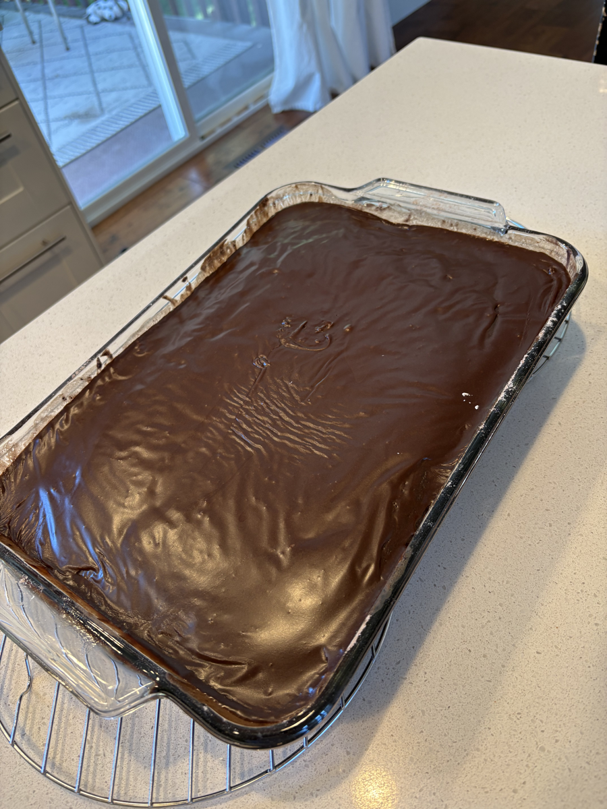

# Crazy Cake

**Recipe Owner:** Jason's mom  
**Serves/Yield:** 9x13-inch cake, about 15 slices  
**Prep time:** 15 min  
**Cook time:** 30-35 min  
**Estimated macros (est.):** ~370 cal | 4g protein | 12g fat | 63g carbs (per slice, about 15 slices)

### Ingredients
- 3 cups flour
- 1 tsp salt
- 2 cups sugar
- 1/3 cup cocoa powder
- 2 tsp baking soda
- 2/3 cup vegetable oil
- 2 Tbsp apple cider vinegar
- 2 cups cold water

### Fudge Frosting
- 2 cups powdered sugar
- 1/4 cup cocoa powder
- 1/8 tsp table salt
- 2 Tbsp plus 2 tsp butter, softened
- 2 Tbsp plus 2 tsp boiling water
- 1/2 tsp vanilla extract

### Instructions
1. Heat oven to 375°F. Grease a 9x13-inch pan.
2. Sift together flour, salt, sugar, cocoa powder, and baking soda.
3. Add vegetable oil, apple cider vinegar, and cold water. Mix well.
4. Pour into prepared pan and bake 30-35 minutes, until the center is set and a toothpick comes out clean.
5. Let cake cool before frosting.
6. For the frosting, beat powdered sugar, cocoa powder, salt, softened butter, boiling water, and vanilla until smooth and spreadable. Spread over cooled cake.

### Family Notes
- Jason's mom used to make this for him when he was a kid, and it is his favorite birthday cake.
- From what I understand, she usually did not frost it. I use a half batch of the fudge frosting from the peanut butter bars recipe.
